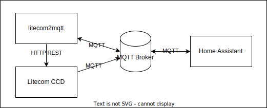

# litecom2mqtt

> Make Zumtobel Litecom CCD fully accessible through MQTT and discoverable by
> Home Assistant.

**🚧 This Project is Work In Progress 🚧**

## Usage

### Environment Variables

_In order to run `litecom2mqtt`, all environment variables not stated as
"optional" must be defined._

| Variable                                                 | Default Value   | Description                                                  |
| -------------------------------------------------------- | --------------- | ------------------------------------------------------------ |
| `LITECOM2MQTT_MQTT_BROKER_URL`                           |                 | The URL to your MQTT broker.<br />Examples: `mqtt://192.168.1.42:1883`, `mqtt://mosquitto:1883` |
| `LITECOM2MQTT_MQTT_TOPIC_PREFIX`                         | `litecom2mqtt`  | Optional. All `litecom2mqtt` MQTT topics are prefixed using this string. |
| `LITECOM2MQTT_LOG_LEVEL`                                 | `ERROR`         | Optional. One of `DEBUG`, `INFO`, `WARNING`, `ERROR`, or `CRITICAL` to control log verbosity. |
| `LITECOM2MQTT_LITECOM_HOST`                              |                 | The host where your Litecom CCD can be reached.<br />Examples: `192.168.1.50`,  `litecom.yourdomain.tld` |
| `LITECOM2MQTT_LITECOM_CONSUMER_NAME`                     |                 |                                                              |
| `LITECOM2MQTT_LITECOM_CONSUMER_API_KEY`                  |                 |                                                              |
| `LITECOM2MQTT_LITECOM_STATE_MQTT_TOPIC_PREFIX`           | `litecom`       | Optional. The topic prefix used by your Litecom CCD to publish state information. |
| `LITECOM2MQTT_HOMEASSISTANT_DISCOVERY_MQTT_TOPIC_PREFIX` | `homeassistant` | Optional. `litecom2mqtt` will announce devices, zones, etc. to Home Assistant within this topic prefix. |

## System Interactions



## Development

`litecom2mqtt` is written in [TypeScript](https://www.typescriptlang.org/) for
[deno](https://deno.com/). You get the best developer experience with
[vscode](https://code.visualstudio.com/) and a
[devcontainer](https://containers.dev/); a
[container configuration](./.devcontainer) is present.

### Update Litecom REST API Client

https://www.npmjs.com/package/openapi-typescript-codegen

1. Download the OpenAPI spec from the Litecom CCD (`https://ADDRESS/docs/rest/`)
   and place it in the projects root as `litecom-openapi.yml`

2. Build the generators Docker image locally, then:

   ```shell
   docker run -v ./:/data openapi-typescript-codegen --input /data/litecom-openapi.yaml --output /data/src/litecom/restClient
   ```

3. Add the `.ts` file extension to all import statements in all files of the
   generated clients. deno needs this.

4. Done.
